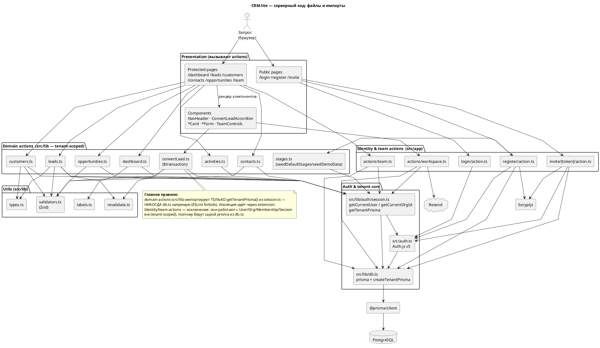

# Структура серверного кода CRM-lite (модули и импорты)

> Диаграмма на уровне **фактических файлов** серверной части: кто какой модуль импортирует/вызывает. Раскрывает блоб «Server Actions & Domain» из `architecture-components.md` на конкретные файлы.
> Узлы — реальные файлы; стрелки — импорты/вызовы (`A → B` = A импортирует/вызывает B).

---

## Диаграмма

---

## Как читать

- **Верх → низ = направление вызовов:** Запрос → страницы/компоненты → actions → auth/tenant-core → Prisma → PostgreSQL.
- **Две разные «траектории» к данным** (ключевое):
  - **Domain actions** (жёлтые, `src/lib`) → `session.ts::getTenantPrisma()` → tenant-extension → БД с фильтром по `organizationId`. Это все CRUD лидов/компаний/контактов/сделок/активностей + `convertLead` + `dashboard`.
  - **Identity & team actions** (`src/app/...`) → **сырой `prisma` из `db.ts`** + `session.ts` (`getCurrentUser/OrgId`) + `auth.ts` (`signIn`). Они трогают `User/Org/Membership/Session/InviteToken` — не бизнес-данные org.
- **`session.ts` — узловая точка:** и domain-actions (через `getTenantPrisma`), и identity/team (через `getCurrentUser/OrgId`), и `auth.ts` (adapter) сходятся к `db.ts`.
- **Внешние:** `Resend` (только `workspace.ts::createInvite`), `bcryptjs` (register/invite — хеш пароля).
- **`middleware.ts`** здесь не показан — он edge, не импортирует ничего из приложения (только проверка cookie); см. `architecture.md`.

---

## Файлы по каталогам (шпаргалка)

| Каталог | Файлы | Роль |
|---|---|---|
| `src/lib/` | `db.ts`, `auth/session.ts` | infra: Prisma-синглтон, `createTenantPrisma`, контекст сессии |
| `src/lib/` | `leads/customers/contacts/opportunities/activities/stages/convertLead/dashboard.ts` | domain-actions (tenant-scoped) |
| `src/lib/` | `validators/labels/types/revalidate.ts` | утилиты (Zod, лейблы, типы, revalidate) |
| `src/auth.ts` | Auth.js v5 config (Credentials, adapter, **JWT** + jwt/session-callbacks) | |
| `src/app/` | `register/login/invite` action.ts; `actions/team.ts`, `actions/workspace.ts` | identity & team actions (raw prisma) |
| `src/app/**`, `src/components/**` | pages + components | Presentation (вызывают actions) |
| `prisma/schema.prisma` | → `@prisma/client` → PostgreSQL | данные |
