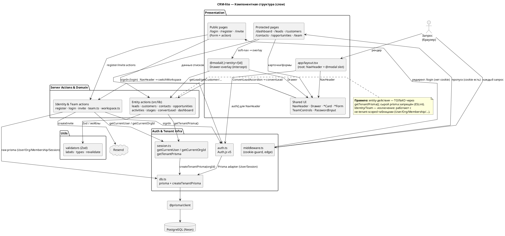

# Компонентная структура CRM-lite

> Внутреннее устройство контейнера **Next.js Application** (уровень компонентов/модулей). Дополняет `architecture.md` (там — контейнерный обзор; здесь — из чего собрано приложение и кто от кого зависит).
> Диаграмма отражает **реализованную** структуру (после A1–A9b).

---

## 1. Компонентная диаграмма (по слоям)



> Если всё ещё шире, чем хочется — рендери с `left to right direction` (слои встанут колонками слева направо, диаграмма станет выше и у́же). Но с объединёнными узлами и `linetype polyline` обычно укладывается компактно сверху вниз.

---

## 2. Слои и их ответственность

| Слой | Что входит | Ответственность |
|---|---|---|
| **Presentation** | `src/app/**` (маршруты + `layout.tsx`), `src/components/**` | RSC-страницы, клиентские формы/компоненты, Drawer-overlay (`@modal`), `NavHeader` |
| **Server Actions & Domain** | `src/lib/*.ts` (entity CRUD, `convertLead`, `dashboard`) + `src/app/actions/*.ts` (`team`, `workspace`) + действия в папках маршрутов (`register`/`login`/`invite`) | Бизнес-логика; две подкатегории — **tenant-scoped** (через `getTenantPrisma`) и **identity/tenancy** (сырой `prisma`) |
| **Auth & Tenant infra** | `src/auth.ts`, `src/middleware.ts`, `src/lib/auth/session.ts`, `src/lib/db.ts` | Auth.js v5, guard, контекст сессии, tenant-extension, Prisma-синглтон |
| **Utils** | `src/lib/{validators,labels,types,revalidate}.ts` | Zod-схемы, типы, лейблы, revalidate-хелпер |
| **Data** | `prisma/schema.prisma` → `@prisma/client` → PostgreSQL (Neon) | Хранилище |

---

## 3. Ключевые архитектурные правила (инварианты)

1. **Два класса server-actions:**
   - **Entity CRUD** (`leads/customers/contacts/opportunities/activities/stages`, `convertLead`, `dashboard`) — **только через `getTenantPrisma()`**. Изоляция гарантируется extension-ом.
   - **Identity & Team** (`register`/`login`/`invite` accept, `team.ts`, `workspace.ts`) — работают с **не-tenant-scoped** таблицами (`User`, `Organization`, `Membership`, `Session`, `InviteToken`) → **сырой `prisma`** напрямую (разрешено).
2. **Сырой `prisma` запрещён** в entity-слое и в компонентах (ESLint `no-restricted-imports`: `import { prisma } from '@/lib/db'`). Разрешён только в `db.ts`, `auth/*` и identity/team действиях.
3. **`getTenantPrisma()`** = `createTenantPrisma(await getCurrentOrgId())`. `getCurrentOrgId` читает `activeOrganizationId` из `session.user` (стратегия **JWT**: токен подписывает Auth.js ключом `AUTH_SECRET`, обогащается в `jwt`-callback из `Session.activeOrganizationId` в БД, копируется в `session.user` в `session`-callback). Единая точка tenant-изоляции.
4. **Точка входа запроса:** браузер → `middleware` (cookie-presence, edge) → маршрут; параллельно `layout.tsx` тянет сессию для `NavHeader`. Public-маршруты (`/login`/`/register`/`/invite`) middleware пропускает.
5. **`convertLead`** — единственная кросс-сущностная `$transaction` через tenant-клиент (`tx` наследует extension): создаёт customer/contact/opportunity в одной org.

---

## 4. Поток зависимостей (направление)

```
Запрос → Presentation → Server Actions & Domain → Auth & Tenant infra → @prisma/client → PostgreSQL
```

Слои не пропускаются: Presentation не лезет в `db.ts`/`prisma` напрямую — только через actions; actions не знают про cookie/headers — только через `getCurrentUser/OrgId`. Утилиты (`validators`, `labels`) — точечные зависимости любого слоя.

---

## 5. Связь с другими документами

- `architecture.md` — контейнерный обзор (Web Client / Next.js / Neon / Resend) и потоки аутентификации/изоляции.
- `auth-architecture-v4.md` — обоснование решений (почему shared-schema, почему extension, роли и т.д.).
- `auth-implementation.md` — код-уровень (целевой `schema.prisma`, SQL-миграции, код `createTenantPrisma`/`convertLead`).
- Здесь — **из чего собрано приложение** (модули и их зависимости).
