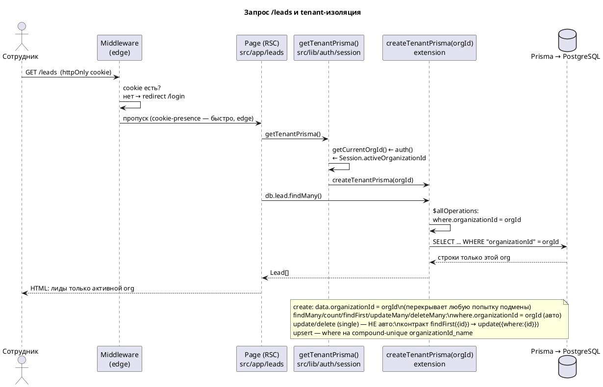

# Архитектура приложения CRM-lite (B2B multi-tenant)

> Описание **реализованной** системы (после фаз A1–A9b). Это обзор на уровне приложения: контейнеры, потоки, модель данных, механизм изоляции.
> Связанные документы: [`auth-architecture-v4.md`](auth-architecture-v4.md) (архитектурные решения и обоснование), [`auth-implementation.md`](auth-implementation.md) (детали реализации: схема, SQL, код).

---

## 1. Обзор

CRM-lite — B2B SaaS: компании-клиенты регистрируются со своими сотрудниками; каждый сотрудник видит только данные своей организации. Изоляция — **shared database, shared schema**: одна БД, фильтрация по `organizationId` через централизованный tenant-клиент. Аутентификация — Auth.js v5 (email/пароль, **JWT-стратегия**). Деплой — Vercel + Neon (PostgreSQL) + Resend (email).

**Стек:** Next.js 16 (App Router), React 19, TypeScript, Prisma 6.19, PostgreSQL (Neon), Tailwind, Auth.js v5, Resend.

---

## 2. Контейнерная диаграмма (C4)

```plantuml
@startuml
!include https://raw.githubusercontent.com/plantuml-stdlib/C4-PlantUML/master/C4_Container.puml
LAYOUT_WITH_LEGEND()
title CRM-lite — Контейнеры (реализовано)

Person(owner, "Владелец компании", "Регистрирует компанию,\nприглашает сотрудников, работает с CRM")
Person(member, "Сотрудник (member)", "Работает с данными своей org;\nне управляет командой")
Person(guest, "Гость", "Неавторизован")

System_Boundary(crm, "CRM-lite (B2B SaaS)") {

  Container(browser, "Web Client", "React 19, Next.js App Router (client), Tailwind", "Формы login/register/invite,\nраздел «Команда», NavHeader\n(workspace switcher + профиль-меню + «Выйти»),\nDrawer-overlay (intercepting routes),\n«глазок» паролей")

  Container(app, "Next.js Application", "Next.js 16 (App Router, server), TypeScript", "Server Components + Server Actions (src/lib/*.ts).\n\n• Middleware (edge): cookie-guard → /login\n• Auth.js v5: Credentials, Prisma adapter, JWT-стратегия\n• Auth Guard: getCurrentUser() / getCurrentOrgId()\n• Tenant Filter: createTenantPrisma(orgId) — авто-инжект organizationId\n• Prisma Client\n• Маршруты: /login /register /invite;\n  /dashboard /leads /customers /contacts /opportunities /team;\n  @modal/(.)<entity> — Drawer-overlay")

  ContainerDb(db, "PostgreSQL", "Neon (serverless, pooled)", "Identity: User, Account, Session, VerificationToken\nTenancy: Organization, Membership, InviteToken\nBusiness (+organizationId): Lead, Customer, Contact,\nOpportunity, Activity, Stage")
}

System_Ext(resend, "Resend", "email-сервис (приглашения)")
System_Ext(oauth, "OAuth Provider", "Google — отложено")

Rel(guest, browser, "Регистрация / вход")
Rel(owner, browser, "Управляет CRM и командой")
Rel(member, browser, "Работает в CRM")

Rel(browser, app, "HTTPS + httpOnly session cookie", "Server Actions / RSC")
Rel_Back(app, browser, "HTML/RSC, Set-Cookie (сессия)")

Rel(app, db, "SQL через Prisma\n(фильтр по organizationId)", "TCP / pooled")
Rel(app, resend, "Отправка invite-писем\n(dev: лог ссылки в консоль)", "HTTPS API")
Rel(app, oauth, "OAuth (отложено)", "HTTPS (опц.)")

note right of app
  <b>Аутентификация:</b> cookie (JWT, подписан AUTH_SECRET) → Auth.js → User.
  <b>Авторизация/tenant:</b> Auth Guard → activeOrganizationId
  (Session БД → jwt-callback → token → session.user).
  <b>Изоляция данных:</b> каждый бизнес-запрос через
  getTenantPrisma() — extension подставляет organizationId
  активной org; подмена orgId в data/where игнорируется.
  <b>Guard роутов:</b> middleware (cookie-presence, edge) +
  server-components (auth() — реальная валидация сессии).
end note

@enduml
```

### 2.1. Назначение контейнеров

| Контейнер | Технология | Ответственность |
|---|---|---|
| **Web Client** | React 19, клиент Next.js, Tailwind | Формы auth, раздел «Команда», `NavHeader` (переключатель workspace + профиль-меню + «Выйти»), Drawer-overlay, UI команд/лидов/сделок |
| **Next.js Application** | Next.js 16 (server), TypeScript | SSR/RSC + Server Actions; здесь живёт **Middleware**, **Auth.js v5**, **Auth Guard**, **Tenant Filter** (`createTenantPrisma`), Prisma; маршруты (public/protected/intercept) |
| **PostgreSQL** | Neon (pooled) | Identity + tenancy + business-данные с `organizationId` |
| **Resend** (внеш.) | email API | Доставка приглашений (dev-fallback — лог ссылки) |
| **OAuth** (внеш., отложен) | Google | Будущий вход через OAuth |

---

## 3. Поток запроса и изоляция данных



**Ключевая идея изоляции:** ни один бизнес-запрос не выполняется без `organizationId`. Центральная точка — `createTenantPrisma(orgId)` (Prisma client extension): для операций чтения/массовых изменений подставляет `organizationId` в `where`, для `create` — в `data` (перекрывая попытку подмены). Single-`update`/`delete` по id не фильтруются автоматически — для них контракт `findFirst({id, organizationId})` → `update({where:{id}})`. Сырой `prisma.*` в бизнес-коде запрещён ESLint-правилом (`no-restricted-imports`), разрешён только в `src/lib/db.ts` и `src/lib/auth/*`.

---

## 4. Аутентификация и авторизация

- **Стратегия сессии — JWT** (`session: { strategy: 'jwt' }` в `src/auth.ts`). Обусловлено технически: провайдер **Credentials несовместим с `database-session`** в Auth.js v5.

- **Как генерируется и живёт JWT:**
  - При `signIn('credentials')` **Auth.js сам** создаёт и подписывает JWT (алгоритм HS256, ключ — `AUTH_SECRET` из `.env`) и кладёт его в **httpOnly-cookie** (`authjs.session-token`, в проде по HTTPS — `__Secure-authjs.session-token`). **JWT не генерируется вручную** — только подпись Auth.js + обогащение через колбэки.
  - **`jwt`-callback** (`src/auth.ts`) обогащает токен на каждом запросе: кладёт `token.id` (при первом входе) и `token.activeOrganizationId` — из `Session.activeOrganizationId` в БД (самая свежая активная Session); если её нет/пусто — авто-выбор первой активной membership и запись в БД.
  - **`session`-callback** копирует `token.id` и `token.activeOrganizationId` в `session.user` → server-components через `auth()` их видят.
  - **Source of truth активной org — `Session.activeOrganizationId` в БД**; JWT — её транспорт/кэш. Поэтому `switchWorkspace` (UPDATE БД) подхватывается на следующем запросе (jwt-callback перечитывает БД).

- **Регистрация** (атомарная `$transaction`): `User` + `Organization` + `Membership(owner)` + 5 стадий (`seedDefaultStages`) + демо-данные (`seedDemoData`: лиды/компании/контакты/сделки/активности + 2 демо-участника Jane/John Doe). Session в транзакции НЕ создаётся — JWT создаёт `signIn`; jwt-callback при необходимости авто-создаст Session-строку в БД.

- **Вход:** `signIn('credentials')` → Auth.js создаёт+подписывает JWT → httpOnly-cookie. jwt-callback выставляет `activeOrganizationId` (авто-membership для свежезарегистрированных).

- **Авторизация:** `getCurrentOrgId()` (`src/lib/auth/session.ts`) читает `activeOrganizationId` из `session.user` (поверх JWT). `switchWorkspace` проверяет membership и `UPDATE Session.activeOrganizationId`.

- **Роли:** `owner` / `member`. Гейтят **только** админку команды (пригласить/сменить роль/исключить/отменить приглашение = owner-only). Доступ к данным — по org (оба видят всё своей организации).

- **Guard роутов:** middleware (edge, проверка наличия cookie → редирект `/login`) + server-components (реальная валидация JWT через `auth()`).

---

## 5. Модель данных (кратко)

- **Identity (Auth.js):** `User`, `Account` (OAuth, пустая), `Session` (с `activeOrganizationId`), `VerificationToken`.
- **Tenancy:** `Organization`, `Membership` (M:N пользователь↔org, роль, статус), `InviteToken`.
- **Business** (все с `organizationId`, per-tenant unique): `Lead` (`ownerUserId`→`User`), `Customer` (ex-Account), `Contact`, `Opportunity`, `Activity`, `Stage` (5 на org, справочник воронки).
- Уникальности per-tenant: `Customer[organizationId,name]`, `Stage[organizationId,name]`/`[organizationId,position]`, `Contact[organizationId,email]`, `Membership[userId,organizationId]`.

Полная схема — в `prisma/schema.prisma` (и `auth-implementation.md` §2).

---

## 6. Развёртывание

- **Vercel** — Next.js приложение (serverless functions).
- **Neon** — PostgreSQL (pooled `POSTGRES_PRISMA_URL` для runtime, `POSTGRES_URL_NON_POOLING` для миграций).
- **Resend** — invite-письма (`RESEND_API_KEY`; без него — лог ссылки в dev).
- Секреты в `.env` (в `.gitignore`): `AUTH_SECRET`, `AUTH_URL`, `DATABASE_URL`, `RESEND_API_KEY`. Шаблон — `.env.example`.

---

## 7. Перспектива (отложено)

OAuth (Google), RLS как второй слой изоляции, роль `admin`, страница профиля (ФИО/телефон) + смена пароля, 2FA, аудит действий, биллинг/лимиты, тонкие права — заложены в `auth-architecture-v4.md` §11 как направления роста без переделки ядра (контракт `createTenantPrisma` остаётся точкой расширения).
