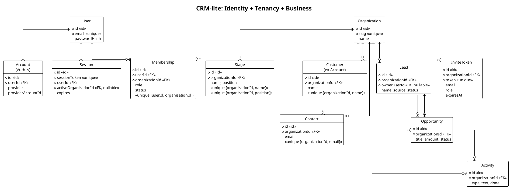

# Архитектура авторизации CRM-lite — B2B multi-tenant

Документ описывает архитектурные решения для изоляции данных организаций-клиентов и их сотрудников в единой БД. Для каждого решения — обоснование, отвергнутые альтернативы и границы применимости. Документ включает стратегию перехода от текущей single-tenant архитектуры к целевой multi-tenant.

> ⚠ **Update (реализация):** стратегия сессии изменена с `database-session` на **JWT** (`session: { strategy: 'jwt' }`) — провайдер Credentials несовместим с database-session в Auth.js v5. Актуальное описание: [`architecture.md`](architecture.md) §4 и `README.md` §1.7. Ниже местами ещё упоминается `database-session` — это design-time, по этому пункту устарело.

---

## 1. Контекст: что есть сейчас и зачем меняем

**Текущее состояние:** 6 доменных моделей (Lead, Account, Stage, Contact, Opportunity, Activity), single-tenant, без аутентификации. Доступ к БД — глобальный синглтон Prisma-клиента. Все операции с данными выполняются без tenant-фильтра.

**Зачем меняем:** CRM должна обслуживать несколько независимых организаций (B2B SaaS). Каждая организация видит только свои данные. Сотрудники входят под своей учётной записью и работают в рамках организации, к которой принадлежат.

---

## 2. Архитектурное решение: изоляция данных

**Выбрано:** Shared database, shared schema — одна БД PostgreSQL, одна схема, каждая строка бизнес-данных содержит `organizationId` → фильтрация на уровне приложения.

**Отвергнутые альтернативы:**

| Альтернатива | Почему отвергнута |
|---|---|
| Отдельная БД на тенанта (database-per-tenant) | Избыточно для масштаба: десятки организаций, а не тысячи. Усложняет миграции, пулинг соединений, крос-тенантную аналитику. |
| Отдельная схема на тенанта (schema-per-tenant) | ORM не поддерживает динамическое переключение схем в рантайме. Потребовало бы ручного управления `search_path` вне ORM. |
| Row-Level Security (RLS) на уровне БД | Идеальный второй слой защиты, но отложен: Neon использует pooled-соединения с PgBouncer, где `SET LOCAL` требует `$transaction`. Включим позже как страховку поверх app-level фильтра. |

**Принятое решение:** app-level фильтрация через централизованный tenant-aware клиент + конвенция использования. RLS — перспективный второй слой.

---

## 3. Архитектурное решение: модель доступа

**Выбрано:** User → Membership → Organization, с активной организацией в сессии.

```
User (человек, email + пароль)
  │
  ├── Membership (роль owner | member, статус active | pending)
  │     └── Organization (тенант, компания-клиент CRM)
  │
  └── через Membership может состоять в нескольких организациях
      (как Slack/Notion: переключение workspace)
```

**Обоснование:**
- **User отделён от Organization через Membership** — это позволяет одному пользователю состоять в нескольких организациях (владелец агентства может иметь тестовую org и рабочую org).
- **Роль на Membership, а не на User** — у одного пользователя могут быть разные роли в разных организациях.
- **Активная организация хранится на Session** — а не в cookie или localStorage. Это означает: нельзя подменить `organizationId` на клиенте, переключение идёт через сервер с проверкой членства.

**Отвергнутая альтернатива:** user_id прямо на Organization (one-to-one). Отвергнута, потому что не позволяет сотруднику работать в нескольких организациях без перелогина.

---

## 4. Архитектурное решение: аутентификация

**Выбрано:** Auth.js v5 (self-hosted), credentials provider (email/пароль), database-session (сессии хранятся в БД).

**Обоснование:**
- **Database-session, а не JWT:** сессии можно отозвать на сервере (сброс пароля, блокировка пользователя). JWT потребовал бы blacklist-таблицу, что по сложности эквивалентно.
- **Credentials provider, а не OAuth сейчас:** email/пароль закрывает потребности B2B-сценария (сотрудники входят по корпоративной почте). Схема БД содержит таблицу для OAuth-привязок, сам OAuth добавляется без изменения модели данных.
- **Self-hosted, а не managed (Clerk/Auth0):** нет внешней зависимости, нет ежемесячных платежей, полный контроль над данными пользователей.

**Граница:** токены приглашений (InviteToken) — не часть Auth.js, а отдельная бизнес-логика. Auth.js управляет только аутентификацией (логин/сессия), но не авторизацией (tenant-фильтр) и не приглашениями.

---

## 5. Целевая модель данных

### 5.1. Новые сущности (identity + tenancy)

| Сущность | Назначение | Ключевые атрибуты |
|---|---|---|
| `User` | Учётная запись человека | email (уникальный), passwordHash |
| `Account` | Привязка OAuth-провайдера (Auth.js) | provider, providerAccountId — требуется адаптером Auth.js |
| `Session` | Сессия пользователя | sessionToken (уникальный), userId, expires, **activeOrganizationId** (nullable, FK → Organization, ON DELETE SET NULL) |
| `VerificationToken` | Токены верификации email | требуется Auth.js |
| `Organization` | Тенант (компания-клиент CRM) | name, slug (уникальный) |
| `Membership` | Связь User↔Organization | userId, organizationId, role (owner/member), status (active/pending). Уникальность на пару [userId, organizationId] |
| `InviteToken` | Приглашение сотрудника | organizationId, email, role, token (уникальный), expiresAt |

### 5.2. Изменения существующих сущностей

**Все 6 доменных моделей** (Lead, Account→Customer, Stage, Contact, Opportunity, Activity) получают:

- `organizationId` — NOT NULL, внешний ключ → Organization, индекс
- Уникальные индексы становятся per-tenant: уникальность в рамках `[organizationId, поле]`, а не глобальная

**Дополнительные изменения:**

| Модель | Изменение | Причина |
|---|---|---|
| `Account` | Переименовать в `Customer` | Конфликт: Auth.js требует модель `Account` для OAuth-привязок. В одной схеме двух `Account` быть не может. |
| `Lead` | `owner` (строка) → `ownerUserId` (FK → User) | Связь ответственного с реальным пользователем |
| `Opportunity` | `stageId` FK: `onDelete: SetNull` → `onDelete: Restrict` | Текущая схема содержит баг: `stageId` объявлен как NOT NULL, но `onDelete: SetNull` — противоречие. ORM позволяет такое объявить, но в рантайме удаление Stage с привязанными Opportunity упадёт. `Restrict` фиксит баг. |
| `Session` | `activeOrganizationId` (FK → Organization, ON DELETE SET NULL) | При удалении Organization поле зануляется — сессия не ломается, пользователь перелогинивается. |

### 5.3. ER-диаграмма



---

## 6. Архитектурное решение: tenant-фильтрация

### 6.1. Поток запроса

```
cookie → Auth.js (проверка sessionToken → User)
       → Session.activeOrganizationId → currentOrgId
       → Tenant-aware клиент БД
       → все запросы к бизнес-данным авто-фильтруются по organizationId
```

### 6.2. Принцип tenant-фильтрации

**Выбрано:** централизованный tenant-aware клиент БД, который для всех операций на бизнес-моделях (lead, customer, contact, opportunity, activity, stage) автоматически инжектит `organizationId` в `where`-условия и `data`-поля.

**Ограничение ORM, которое определяет дизайн:** операции поиска/обновления/удаления по одиночному уникальному ключу (например, `findUnique({ id })`, `update({ where: { id } })`) не принимают дополнительные поля в `where`-условие. Попытка инжекта `organizationId` вызывает ошибку компиляции.

**Решение — двухуровневая стратегия:**

| Уровень | Операции | Механизм |
|---|---|---|
| **Автоматический** (tenant-клиент) | `findMany`, `count`, `aggregate`, `updateMany`, `deleteMany`, `create`, `findFirst` | `organizationId` инжектится в `where`/`data` — прозрачно для разработчика |
| **Ручной** (в коде server action) | `update`/`delete` по одиночному id | Двухшаговый подход: `findFirst({ id, organizationId })` → затем `update`/`delete` по одному `id`. Альтернативно — `updateMany`/`deleteMany` с составным `where` (покрываются автоматическим уровнем) |

**Почему не составной уникальный ключ `[organizationId, id]` на всех таблицах:** это позволило бы перенести `update`/`delete` по id в автоматический уровень, но ценой избыточного составного индекса на каждой бизнес-таблице. При текущем масштабе (десятки организаций, не тысячи) двухуровневый подход достаточен.

**Гарантия:** ни один запрос к бизнес-данным не выполняется без `organizationId`. Id-lookups идут через `findFirst({ id, organizationId })` — чужой лид по угаданному id не вернётся.

### 6.3. Конвенция и защита от обхода

**Прямой доступ к БД (без tenant-клиента) запрещён везде, кроме:**
- Модуль, экспортирующий tenant-клиент
- Инфраструктура аутентификации (не работает с бизнес-данными)

**Закрепляется статическим анализом** (lint-правило) — запрет импорта «голого» клиента БД в бизнес-коде.

---

## 7. Ключевые сценарии

### 7.1. Регистрация компании (первый пользователь = owner)

**Атомарная транзакция:**
1. Создание User (email, passwordHash)
2. Создание Organization (name, slug)
3. Создание Membership (userId, organizationId, role=owner, status=active)
4. Создание Session (userId, activeOrganizationId = organizationId)

**Точка отказа:** сбой на любом шаге → откат всей транзакции. Нет «битых» partial-данных (пользователь без организации, организация без владельца).

### 7.2. Приглашение сотрудника

**Создание (owner):**
1. Проверка: текущий пользователь принадлежит организации
2. Создание InviteToken (organizationId, email, role, token, expiresAt)
3. Отправка email со ссылкой `/invite?token=...`

**Принятие (сотрудник):**
1. Валидация токена: срок не истёк, не использован
2. **Атомарная транзакция:**
   - Аннулировать токен
   - Find-or-create User (email)
   - Создание Membership (organizationId, userId, role, active)
   - Создание Session (userId, activeOrganizationId = organizationId)

### 7.3. Переключение workspace

1. Layout загружает список Membership пользователя
2. UI показывает переключатель: Org A (активна), Org B
3. При выборе Org B: сервер проверяет Membership(user, orgB, status=active)
4. Обновление `Session.activeOrganizationId = orgB`
5. Инвалидация кэша → все последующие запросы фильтруются по orgB

**Защита:** нельзя переключиться на организацию без активного членства. Подмена `organizationId` на клиенте невозможна — источник правды на сервере в `Session.activeOrganizationId`.

### 7.4. Запрос к данным (авторизованный)

1. Auth.js читает cookie → Session → User
2. `Session.activeOrganizationId` → текущий orgId
3. Tenant-aware клиент БД применяет `organizationId` ко всем операциям
4. Данные другой организации не возвращаются ни при каких условиях

---

## 8. Стратегия перехода (от single-tenant к multi-tenant)

Переход разбит на 4 стадии по возрастанию риска. Порядок критичен: каждая следующая стадия предполагает завершение предыдущей.

### Стадия 1: Новые таблицы (identity + tenancy)
- **Что:** 7 новых таблиц — User, Account (Auth.js), Session, VerificationToken, Organization, Membership, InviteToken
- **Риск:** нулевой — чистые добавления, не трогают существующие данные
- **Метод:** автоматическая генерация миграции

### Стадия 2: Tenant-scoping существующих таблиц
- **Что:** `organizationId` + NOT NULL + внешний ключ + индексы + per-tenant уникальность на всех 6 бизнес-таблицах
- **Риск:** высокий — неправильный порядок операций может привести к потере данных
- **Метод:** ручная миграция (nullable колонка → backfill дефолтной Organization → NOT NULL → FK → индекс → unique)
- **Почему не авто-миграция:** инструмент миграции не справляется с NOT NULL на непустой таблице без default-значения

### Стадия 3: Переименование Account → Customer
- **Что:** переименование таблицы в БД + обновление модели + рефакторинг кода
- **Риск:** высокий при использовании авто-миграции (drop+create вместо rename), низкий при ручном переименовании
- **Метод:** ручное переименование таблицы в БД

### Стадия 4: Обновление seed-данных
- **Что:** дефолтная Organization + owner User + Membership + organizationId на всех seed-строках
- **Риск:** средний — рассинхрон seed с миграцией ломает сброс БД

---

## 9. Известные конфликты и узкие места

### 9.1. Конфликт имён: Account (CRM) vs Account (Auth.js)

Auth.js требует модель `Account` для OAuth-привязок. Существующая CRM использует `Account` для компании-заказчика. Две модели с одним именем в одной схеме невозможны.

**Решение:** CRM-модель `Account` → `Customer`. Семантически точнее: `Organization` = тенант (агентство), `Customer` = его клиент.

**Затрагивает:** схему БД, модуль работы с компаниями, роут `/accounts`, компонент навигации, транзакцию конвертации лида, seed-данные.

### 9.2. `findUnique` несовместим с tenant-фильтром

ORM не принимает дополнительные поля в `where` у операции поиска по уникальному ключу — только строго уникальный селектор. Инжект `organizationId` вызывает ошибку компиляции.

**Решение:** все id-lookups → `findFirst` с составным `where: { id, organizationId }`. `findUnique` допустим только в инфраструктурном коде (auth).

### 9.3. `convertLead` — критичная транзакция

Текущая транзакция конвертации лида (единственное место с атомарной транзакцией) требует 4 изменений:
1. Поиск лида: `findUnique({ id })` → `findFirst({ id, organizationId })` — защита от конвертации чужого лида
2. Upsert компании: глобальный `upsert({ name })` → per-tenant `upsert` по `[organizationId, name]`
3. Поиск стадии: `findUnique({ name })` → `findFirst({ name, organizationId })` — стадия в рамках организации
4. Все создаваемые сущности должны получить единый `organizationId` — гарантируется tenant-клиентом

### 9.4. Seed-данные требуют `organizationId`

После Стадии 2 все бизнес-таблицы имеют NOT NULL `organizationId`, но seed-данные его не содержат.

**Решение:** создать дефолтную Organization («Demo Agency») + owner User + Membership, всем seed-строкам проставить `organizationId`.

---

## 10. Риски

| Риск | Вероятность | Последствия | Стратегия |
|---|---|---|---|
| Авто-миграция делает drop+create вместо ALTER | Высокая | Потеря данных | Ручная миграция для Стадии 2, ручное переименование таблицы для Стадии 3 |
| Утечка tenant: забытый `organizationId` в where | Средняя | Данные другой org доступны | Tenant-клиент — центральная защита. Линт-правило запрещает обход клиента |
| `convertLead` ломается при переходе на per-tenant уникальность | Средняя | Конвертация не работает | Per-tenant `upsert where`, тестирование контрольного сценария |
| Seed падает после миграции | Высокая | Сброс БД не работает | Синхронное обновление seed, проверка счётчиков (5/4/5/6/6/8) |
| Порядок FK: Organization нужна до NOT NULL organizationId | Высокая | Миграция падает | Стадия 1 строго до Стадии 2 |
| `Session.activeOrganizationId` FK → удаление Organization | Средняя | Сессия ломается при удалении org | `ON DELETE SET NULL` — поле зануляется |

---

## 11. Перспективный рост (эволюция без переделки ядра)

| Возможность | Что добавить | Что НЕ меняется |
|---|---|---|
| OAuth / Google-вход | provider-конфиг Auth.js; таблица для OAuth уже в схеме | Модель User, контракт tenant-доступа |
| RLS (2-й слой защиты) | `CREATE POLICY` + `$transaction` + `SET LOCAL` | Контракт tenant-клиента — RLS поверх него |
| Роль `admin` | Значение в `MembershipRole` + проверки в server actions | Схема Membership |
| Аудит действий | Таблица `AuditLog` + hook в tenant-клиент | Бизнес-модели |
| SSO / SAML | Через `Account.provider` | Поток запроса |
| Лимиты / биллинг | Поля на `Organization` + проверки в middleware | Изоляция данных |
| Подразделения / команды | Подчинённая сущность + доп. фильтр в tenant-клиент | Tenant-контракт |
| Soft-delete / архив | Флаг `deletedAt` + фильтр в tenant-клиент | Схема связей |

---

## 12. Принятые ограничения

- **RLS отложен** — Neon pooled-соединения требуют `$transaction` для `SET LOCAL`; app-level фильтрации достаточно для текущего масштаба. Включим как страховку позже.
- **OAuth отложен** — email/пароль закрывает потребности B2B-сценария; схема готова (таблица для OAuth-привязок присутствует).
- **Удаление Organization** — внешний ключ бизнес-таблиц → Organization: `CASCADE` (GDPR-совместимое удаление всех данных тенанта). Внешний ключ `Session.activeOrganizationId` → Organization: `SET NULL` (сессия не ломается при удалении org). UI удаления организации не делаем в текущей версии.
- **Аутентификация** — Auth.js v5 (self-hosted), credentials provider, database-session. Без внешних managed-сервисов.
- **Email** — Resend для invite-писем.

---

## 13. Отвергнутые альтернативы (сводка)

| Решение | Альтернатива | Причина отказа |
|---|---|---|
| Shared DB + schema | Database-per-tenant | Избыточно для масштаба, усложняет пулинг и миграции |
| App-level tenant-фильтр | RLS как единственный слой | Neon pooling: `SET LOCAL` требует `$transaction` |
| Database-session (Auth.js) | JWT | Невозможность серверного отзыва без blacklist-таблицы |
| Credentials provider | Только OAuth | B2B: сотрудники входят по корпоративной почте |
| Self-hosted Auth.js | Managed (Clerk/Auth0) | Нет внешней зависимости, полный контроль данных |
| Membership-связка | user_id на Organization | Не позволяет быть в нескольких организациях без перелогина |
| Active org в сессии | Active org в cookie/localStorage | Клиентская подмена organizationId |
| `findFirst` для id-lookups | Составной уникальный ключ `[orgId, id]` на всех таблицах | Избыточный составной индекс на каждой таблице |
| Двухшаговый update/delete | Составной уникальный ключ для update/delete по id | Та же причина — избыточный индекс |